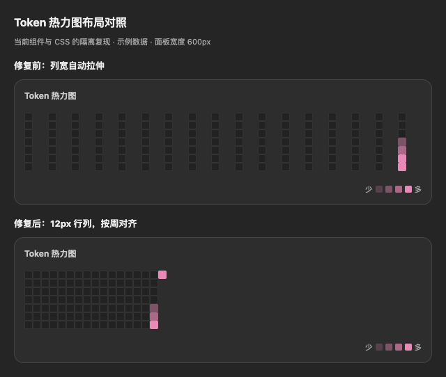

# Issue #30 热力图修复决策

## 目标与约束

- 修复桌面设置中每日格子被横向拉开的现象。
- 使用现有 12px 格子、主题变量、四档色阶和悬浮提示。
- 保持 README 承诺的 17 周视图；每列从周日开始，到今天结束，不生成未来日期。
- 使用本机日历，与存储的 `dayKey` 一致；跨月、跨年和夏令时不丢日期。
- 无记录时显示已有提示；已记录的零 token 日期仍可显示日历。
- 不增加运行时依赖、网络请求或数据存储；维护者通过现有离线测试运行器验收。

## 证据与选择

当前 Grid 隐式列宽为 `auto`，剩余宽度会拉宽轨道，格子仍为 12px。
Chromium 中 560px 面板的格子横向空白约为 19px；取消 `gap` 不能消除轨道内部空白。

只设置 `justify-content:start` 可以消除拉伸；本次同时固定 12px 行列尺寸，
使网格与格子保持一致，并保留窄容器横向滚动。

原日期表达式不能稳定从周日开始。本次先确定当前周的周日，再向前取 16 周，
共显示 17 列、113 至 119 个日期。所有日期用本地 `setDate` 递增，
并以本地中午为锚点，避免午夜夏令时切换导致漏掉最后一天。

`buildHeatCells([])` 原本仍生成零值格子，使已有空态分支不可达。
本次让无记录输入返回空数组，不把零 token 记录误判为无记录。

## 验证

`scripts/heatmap-test.mjs` 通过真实客户端测试接缝覆盖一周七天、跨年、闰日、
上海与纽约时区、夏令时、连续日期、数据投影、空态、零值记录和悬浮提示。
临时 Chromium 复现页另检查格子间距和窄容器滚动；发布前仍需按 RELEASING.md
使用发布私钥更新签名清单。

本次热力图 40 项检查、客户端 lint 和公告 sanitizer 检查均通过。
Chromium 在 160/320/560/900px 面板中保持 12px 行列步长及零列间空白，
160px 面板保留横向滚动。签名清单检查因 `client.js` 摘要变化失败；
当前环境未配置 `OFM_MANIFEST_KEY`，发布签署待维护者完成。

截图使用组件与当前 CSS 的隔离复现及示例数据，不代表真实 DSH 宿主验收。
贡献者没有发布签名权限；维护者须在合并到 main 前重建并签署发布清单，
同步目录完整性记录，并按发布文档刷新 source revision。
